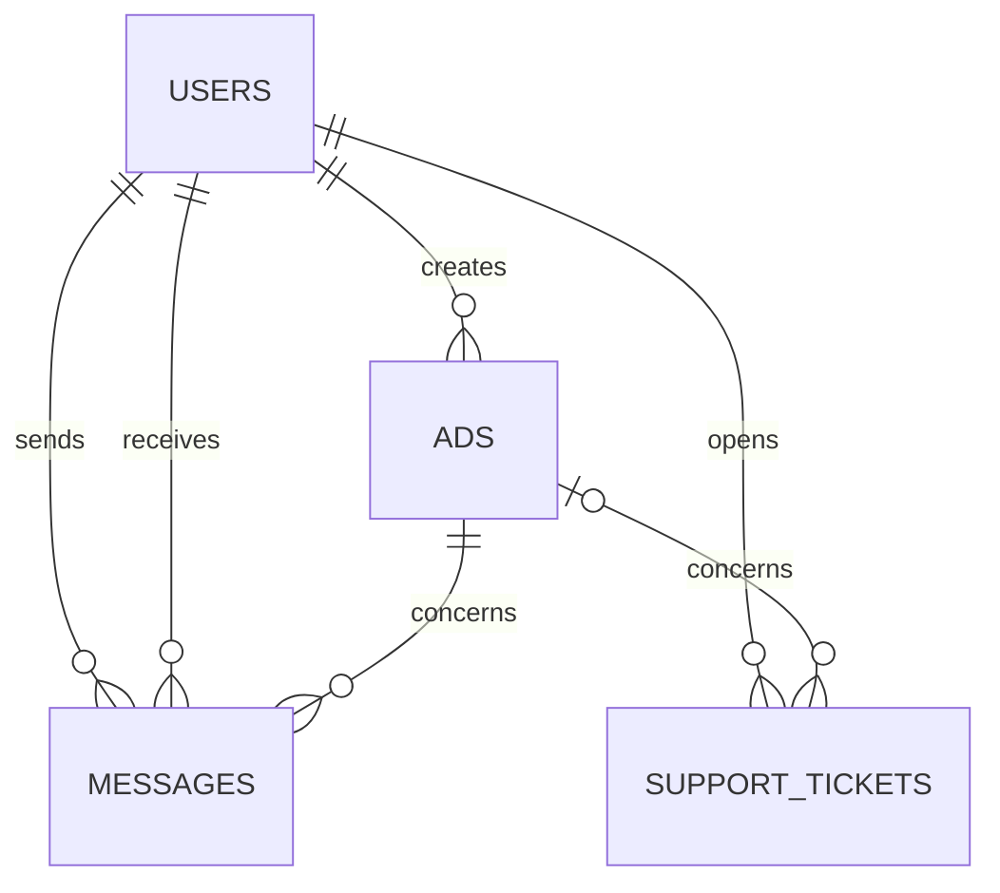

# Marketplace Support SQL

A portfolio project that simulates the day-to-day data work of a Technical Support Engineer at an online marketplace. It uses a small, realistic MySQL dataset to investigate account, listing, messaging, and ticketing issues.

## Highlights

- MySQL 8+ relational schema with foreign keys, validation rules, and indexes
- Deterministic fictional data: 20 users, 20 ads, 28 messages, and 22 support tickets
- Ten support scenarios that demonstrate joins, aggregations, `CASE`, date logic, CTEs, and window functions
- Validation queries to verify the database after setup

## Data model

`support_tickets.ad_id` is optional because a ticket can concern an account rather than a listing.

## Requirements

- MySQL 8.0.16 or newer
- A SQL client such as MySQL Workbench, DBeaver, or the MySQL command-line client

## Run the project

Run the scripts in this exact order from a clean MySQL server:

1. `database/01_schema.sql`
2. `database/02_seed_data.sql`
3. `database/03_validation.sql`
4. Any file in `support_cases/`

Each case sets `@as_of` to `2026-07-10 12:00:00` so its results stay reproducible. Change that value only when you intentionally want to analyse a different reporting date.

## Support cases

| File | Question | SQL techniques |
| --- | --- | --- |
| `01_stale_unverified_accounts.sql` | Which accounts need verification outreach? | `CASE`, date arithmetic |
| `02_listings_without_response.sql` | Which active listings have not received a buyer message? | `LEFT JOIN`, aggregation |
| `03_unread_message_sla.sql` | Which messages have breached the 24-hour read SLA? | joins, date arithmetic |
| `04_ticket_backlog.sql` | Which open tickets need the fastest attention? | `CASE`, ordering |
| `05_resolution_time_by_category.sql` | How quickly are ticket categories resolved? | aggregation, timestamps |
| `06_repeat_contact_users.sql` | Which users repeatedly contact support? | CTE, `HAVING` |
| `07_support_load_by_city.sql` | Where is support demand concentrated? | CTE, joins |
| `08_agent_workload_ranking.sql` | How is the workload distributed between agents? | window functions |
| `09_listing_category_ticket_rate.sql` | Which listing categories create the most support load? | `NULLIF`, aggregation |
| `10_user_support_timeline.sql` | What is a user's chronological support history? | `UNION ALL`, window functions |

## Portfolio outcome

This project shows how a support-oriented data model can be designed, validated, and queried to turn operational questions into actionable queues and service metrics. All people, listings, companies, and support events are fictional.

